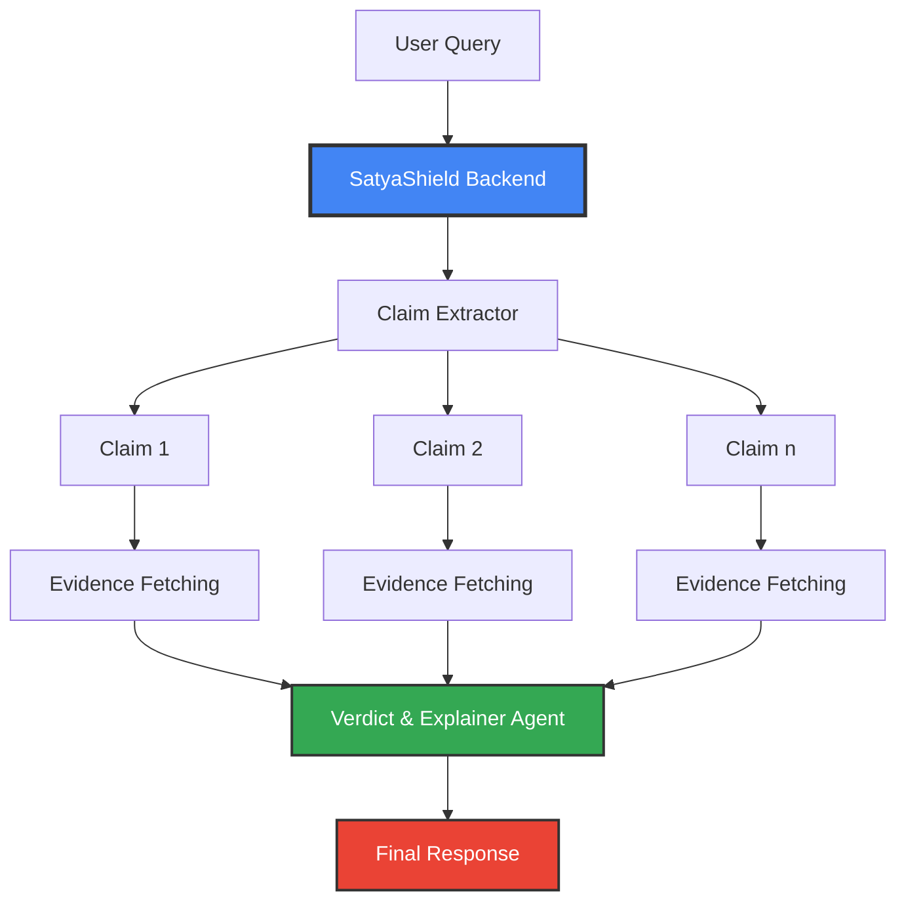

# 🛡️ SatyaShield Backend

<div align="center">
  <strong> </b>AI-Powered Misinformation Detection Engine </strong>
  
  *Empowering digital literacy through intelligent fact-checking*

  [](https://fastapi.tiangolo.com/)
  [](https://cloud.google.com/)
  [](https://ai.google.dev/)
  [](https://python.org/)

</div>

---

## 🎯 Mission

In an era where misinformation spreads faster than wildfire, **SatyaShield** stands as India's digital guardian. Our AI-powered backend engine doesn't just detect fake news—it educates users on the manipulative techniques used to spread misinformation, fostering a more critical and informed digital society.

## ✨ What Makes Us Special

🧠 **Intelligent Claim Extraction** - Automatically identifies verifiable claims from complex text and images  
🔍 **Parallel Evidence Gathering** - Simultaneous fact-checking across multiple reliable sources  
📊 **Confidence Scoring** - Transparent reliability metrics for every verdict  
🎭 **Manipulation Detection** - Identifies psychological techniques used to spread misinformation  
📚 **Educational Insights** - Provides actionable tips to improve digital literacy  
⚡ **Multi-Modal Support** - Processes both text queries and image content seamlessly

---

## 🏗️ Architecture



The backend employs a sophisticated **LangGraph-based AI agent** that orchestrates:
- **Claim Extraction**: Intelligently parses input to identify factual claims
- **Parallel Processing**: Simultaneous evidence gathering for maximum efficiency  
- **Verdict Generation**: AI-powered analysis with confidence scoring
- **Educational Component**: Identifies manipulation techniques and provides learning resources

---

## 🚀 Quick Start

### Prerequisites
- Python 3.9+
- Google Cloud credentials
- API keys for Tavily and Google Fact Check

### Installation

```bash
# Clone the repository
git clone https://github.com/Satya-Shield/Backend.git
cd Backend

# Install uv (if not installed)
pip install uv

# Install dependencies
uv sync

# Set up environment variables
cp .env.example .env
# Edit .env with your API keys

# Run the server
uv run run.py
```

🎉 Your SatyaShield backend is now running at `http://localhost:8000`

---

## 🔗 API Endpoints

### Base URL: `https://satyashield-backend-60le.onrender.com`

<details>
<summary><strong>📝 Text Query Analysis</strong></summary>

**Endpoint:** `POST /api/run_agent`

Analyzes text content for potential misinformation.

```bash
curl -X POST "https://satyashield-backend-60le.onrender.com/api/run_agent" \
     -H "Content-Type: application/json" \
     -d '{"query": "USA imposed heavy tariff on India"}'
```

**Request Body:**
```json
{
    "query": "USA imposed heavy tariff on India"
}
```
</details>

<details>
<summary><strong>📷 Image File Analysis</strong></summary>

**Endpoint:** `POST /api/read_image_file`

Analyzes uploaded image files for misinformation.

```bash
curl -X POST "https://satyashield-backend-60le.onrender.com/api/read_image_file" \
     -H "Content-Type: application/json" \
     -d '{"query": "Is this image correct?", "image": "/path/to/image.jpg"}'
```

**Request Body:**
```json
{
    "query": "Is this image correct?",
    "image": "file_path_here"
}
```
</details>

<details>
<summary><strong>🌐 Image URL Analysis</strong></summary>

**Endpoint:** `POST /api/read_image_url`

Analyzes images from URLs for misinformation.

```bash
curl -X POST "https://satyashield-backend-60le.onrender.com/api/read_image_url" \
     -H "Content-Type: application/json" \
     -d '{"query": "USA imposed heavy tariff on India", "image": "https://example.com/image.jpg"}'
```

**Request Body:**
```json
{
    "query": "Verify the information",
    "image": "https://example.com/image.jpg"
}
```
</details>

---

## 📊 Response Format

All endpoints return a structured JSON response with detailed analysis:

```json
[
    {
        "claim": "The USA imposed a heavy tariff on India",
        "verdict": "True",
        "confidence": 90,
        "explanation": "True. The claim is well-supported by evidence from reputable sources...",
        "sources": [
            "https://www.theguardian.com/us-news/2025/aug/27/trump-50-percent-tariff-india-explainer",
            "https://www.nytimes.com/2025/08/27/business/india-tariffs-trump-russia-oil.html"
        ],
        "techniques": [
            "None detected"
        ],
        "checklist": [
            "Verify with official government sources",
            "Check financial news agencies for detailed analysis",
            "Confirm article dates for current information"
        ]
    }
]
```

### Response Fields

| Field | Type | Description |
|-------|------|-------------|
| `claim` | string | Extracted factual claim |
| `verdict` | string | True/False/Partially True/Inconclusive |
| `confidence` | integer | Confidence score (0-100) |
| `explanation` | string | Detailed reasoning behind the verdict |
| `sources` | array | Credible sources used for verification |
| `techniques` | array | Identified manipulation techniques |
| `checklist` | array | User education tips for verification |

---

## 🧠 Technology Stack

<div align="center">

| Component | Technology | Purpose |
|-----------|------------|---------|
| **Framework** | FastAPI | High-performance async API framework |
| **AI Engine** | Gemini-2.5-Pro | Advanced language model for claim analysis |
| **Agent Framework** | LangGraph | Orchestrates complex AI workflows |
| **Fact Checking** | Google Fact Check API | Authoritative fact verification |
| **Web Search** | Tavily API | Intelligent web search for evidence |
| **Cloud Platform** | Google Cloud | Scalable infrastructure |

</div>

---

## 🌟 Key Features

### 🎯 **Multi-Modal Intelligence**
- **Text Analysis**: Processes complex textual content from any source
- **Image Recognition**: OCR and visual content analysis for memes, screenshots, and graphics
- **Context Awareness**: Understands cultural nuances and Indian context

### ⚡ **Parallel Processing Architecture**
- **Concurrent Claim Processing**: Handles up to 4 claims simultaneously
- **Optimized Performance**: Sub-second response times for critical misinformation detection
- **Scalable Design**: Built to handle high-volume traffic during viral misinformation events

### 🎓 **Educational Framework**
- **Technique Identification**: Recognizes 15+ manipulation strategies
- **User Empowerment**: Provides actionable verification checklists
- **Digital Literacy**: Builds long-term critical thinking skills

---


## 🌍 SatyaShield Ecosystem

SatyaShield is more than just a backend—it's a comprehensive misinformation combat platform:

<div align="center">

| Component | Repository | Description |
|-----------|------------|-------------|
| 🌐 **Website** | [Frontend](https://github.com/Satya-Shield/Frontend) | User-friendly web interface for fact-checking |
| 🔧 **Browser Extension** | [Browser-Extension](https://github.com/Satya-Shield/Browser-Extension) | One-click verification on any website |
| 💬 **WhatsApp Bot** | [Whatsapp-Bot](https://github.com/Satya-Shield/Whatsapp-Bot) | Instant fact-checking via messaging |
| ⚙️ **Backend API** | This Repository | Core AI engine powering all platforms |

</div>

### 📱 WhatsApp Integration
Send your queries directly to our WhatsApp bot: **+1 (555) 148-2620**

---

## 🤝 Contributing

We welcome contributions from the community! Here's how you can help:

1. **🍴 Fork the repository**
2. **🌿 Create a feature branch** (`git checkout -b feature/amazing-feature`)
3. **💻 Make your changes** (follow our coding standards)
4. **✅ Add tests** for new functionality
5. **📝 Commit your changes** (`git commit -m 'Add amazing feature'`)
6. **🚀 Push to the branch** (`git push origin feature/amazing-feature`)
7. **🎉 Open a Pull Request**

### Development Guidelines

- Follow PEP 8 coding standards
- Write comprehensive tests for new features
- Update documentation for API changes
- Ensure backward compatibility

---

## 📄 License

This project is licensed under the **MIT License** - see the [LICENSE](LICENSE) file for details.

---

## 🙏 Acknowledgments

- **Google Cloud** for providing the AI infrastructure
- **Tavily** for robust web search capabilities
- **FastAPI Community** for the excellent framework
- **Open Source Contributors** who make projects like this possible

---

<div align="center">
  
  **🛡️ Fighting misinformation, one fact at a time.**
  
  *Made with ❤️ for a more informed India*

  **[⭐ Star us on GitHub](https://github.com/Satya-Shield/Backend)** if you believe in our mission!

</div>

---

## 🔗 Related Repositories

- 🌐 **[Frontend](https://github.com/Satya-Shield/Frontend)** - React-based web application
- 🔧 **[Browser Extension](https://github.com/Satya-Shield/Browser-Extension)** - Chrome/Firefox extension for instant verification
- 💬 **[WhatsApp Bot](https://github.com/Satya-Shield/Whatsapp-Bot)** - Messaging platform integration
---

*"Truth is not determined by majority vote." - Doug Gwyn*

